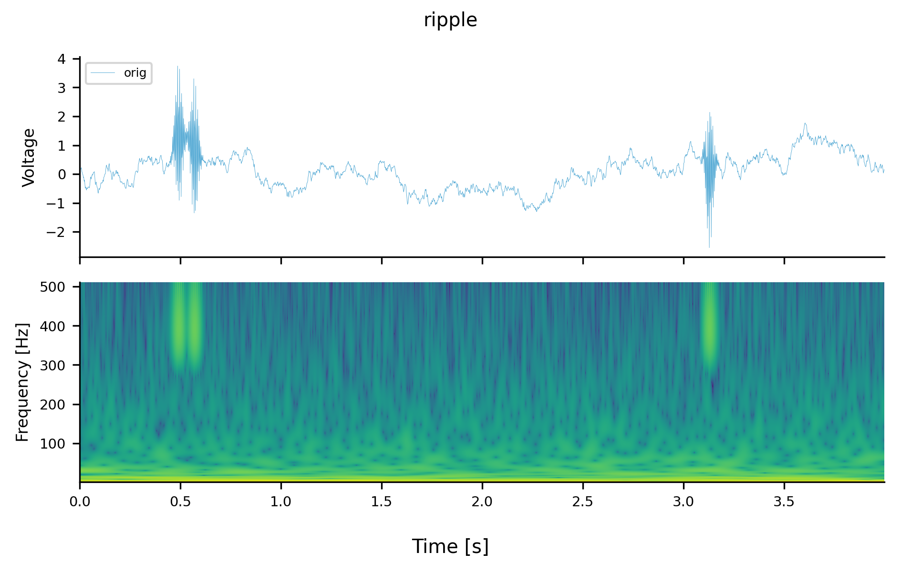

# ezDSP: Easy Digital Signal Processing

ezDSP is a digital signal processing toolbox written in PyTorch (`./src/ezdsp/nn/`). However, ezDSP not only processes torch.tensors (CPU & GPU) but also handles numpy.ndarray and pd.DataFrame, enabling a consistent and intensive workflow.

## Installation
```bash
$ pip install ezdsp
$ python ./example.py # ./example_outputs/ will be generated.
```

## Samples
#### Normalization, Resampling, Noise Addition, Filtering, Hilbert Transformation
<div align="center">
  
</div>

#### Wavelet Transformation
<div align="center">
  
</div>

#### Power Spectrum Density
<div align="center">
  
  
</div>

#### Phase-Amplitude Coupling
<div align="center">
  
</div>

## Quick Start
``` python
import ezdsp as ed

# Parameters
SRC_FS = 1024  # Source sampling frequency
TGT_FS = 512   # Target sampling frequency
FREQS_HZ = [10, 30, 100]  # Frequencies in Hz
LOW_HZ = 20    # Low frequency for bandpass filter
HIGH_HZ = 50   # High frequency for bandpass filter
SIGMA = 10     # Sigma for Gaussian filter
SIG_TYPES = [
    "uniform",
    "gauss",
    "periodic",
    "chirp",
    "ripple",
    "meg",
    "tensorpac",
] # Available signal types


# Demo Signal
xx, tt, fs = ed.demo_sig(
    t_sec=T_SEC, fs=SRC_FS, freqs_hz=FREQS_HZ, sig_type="chirp"
)
# xx is either of torch.tensor (on cpu / cuda), numpy.ndarray, or pd.DataFrame.

# Normalization
xx_norm = ed.norm.z(xx)
xx_minmax = ed.norm.minmax(xx)

# Resampling
xx_resampled = ed.resample(xx, fs, TGT_FS)

# Noise addition
xx_gauss = ed.add_noise.gauss(xx)
xx_white = ed.add_noise.white(xx)
xx_pink = ed.add_noise.pink(xx)
xx_brown = ed.add_noise.brown(xx)

# Filtering
xx_filted_bandpass = ed.filt.bandpass(xx, fs, low_hz=LOW_HZ, high_hz=HIGH_HZ)
xx_filted_bandstop = ed.filt.bandstop(xx, fs, low_hz=LOW_HZ, high_hz=HIGH_HZ)
xx_filted_gauss = ed.filt.gauss(xx, sigma=SIGMA)

# Hilbert Transformation
phase, amplitude = ed.hilbert(xx) # or envelope

# Wavelet Transformation
wavelet_coef, wavelet_freqs = ed.wavelet(xx, fs)

# Power Spetrum Density
psd, psd_freqs = ed.psd(xx, fs)

# Phase-Amplitude Coupling
pac, freqs_pha, freqs_amp = ed.pac(x_3d, fs) # This function is computationally demanding. Please monitor the RAM/VRAM usage.
```

# Alias
[`mngs.dsp`](https://github.com/ywatanabe1989/mngs/src/mngs/dsp/) has the same functionalities.

# Contact
Yusuke Watanabe (ywata1989@gmail.com).

